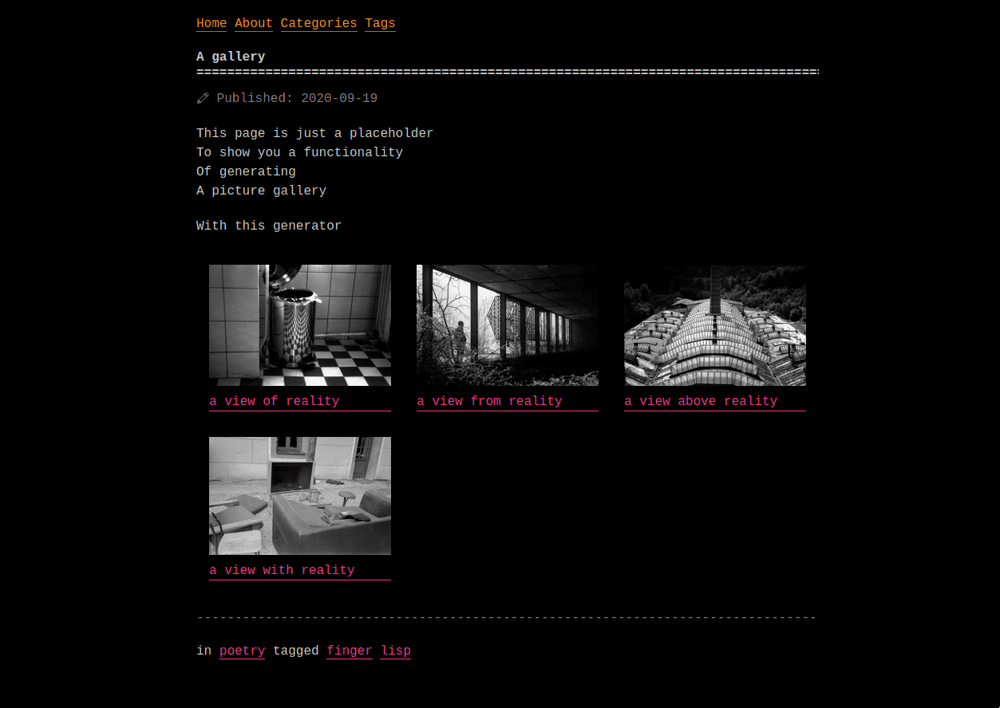

# after-dark



## [Live demo](https://blade386.netlify.app/)

after-dark is a port of the eponymous theme for [Blades](https://github.com/grego/blades) based on:

- [Hugo version](https://git.habd.as/comfusion/after-dark)
- [Zola version](https://github.com/getzola/after-dark)


## Installation
Clone it into your themes directory:
```bash
$ cd themes
$ git clone https://github.com/grego/after-dark
```

Or use it as a submodule:
```bash
$ cd themes
$ git submodule add https://github.com/grego/after-dark 
```

Then, set it as a theme in your `Blades.toml`:
```toml
theme = "after-dark"
```

## Colors
You can change the main and accent color of this them by modifying the corresponding variables
at the beginning of `assets/style.css`. 
Then, run `blades colocate`.

## Images
If you want to use the picture gallery provided by this theme, place your thumbnails in the
`img/thumb` and your full images to the `img/full` subdirectories of your output directory
(which defaults to `public`, unless set otherwise in the config).

## License
[MIT](LICENSE)
